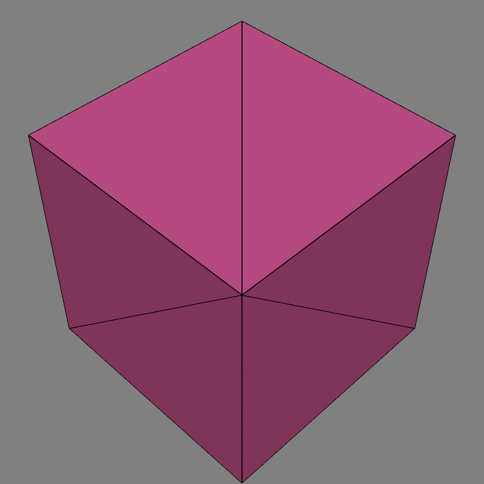
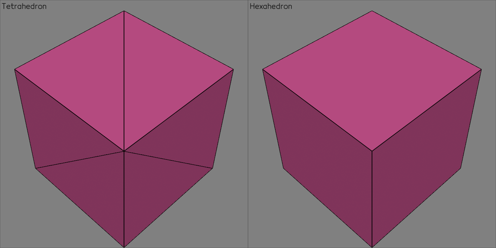

__gustaf__ is a python library to process and visualize numerical-analysis-geometries; especially for Finite Element Methods (FEM) and Isogeometric Analysis (IGA).
gustaf currently supports linear elements:
- triangle,
- quadrilateral,
- tetrahedron, and
- hexahedron,

as well as both single and multi-patch splines (with `splinepy` extension):
- Bezier,
- Rational Bezier,
- BSpline, and
- NURBS.


# Installation
`gustaf` only has `numpy` for its strict dependency. The minimal version can be installed using `pip`.
```
pip install gustaf
```
To install all the [optional dependencies](#optional-dependencies) at the same time, you can use:
```
pip install gustaf[all]
```
For the latest develop version of gustaf:
```
pip install git+https://github.com/tataratat/gustaf.git@main
```

# Quick Start
This example shows how to visualize and extract properties of tetrahedrons and NURBS using gustaf.
For visualization, gustaf uses [vedo](https://vedo.embl.es) as main backend.

To begin we need to import the needed libraries:

```python
import gustaf as gus
import numpy as np
```
## Create a tetrahedron
Now we create our first volume. It will be just a basic cube. Even here we can
already choose between using a tetrahedron and a hexahedron-based
mesh. The `Volume` class will use tetrahedrons if the volumes keyword is made
up of list of 4 elements (defining the corners of the tetrahedron), if 8
elements are in each list hexahedrons are used ([defining the corners of the hexahedron in the correct order](https://tataratat.github.io/gustaf/gustaf.utils.html#gustaf.utils.connec.make_hexa_volumes)).
```python

# create tetrahedron mesh using Volumes
# it requires vertices and connectivity info, volumes
tet = gus.Volumes(
    vertices=[
        [0.0, 0.0, 0.0],
        [1.0, 0.0, 0.0],
        [0.0, 1.0, 0.0],
        [1.0, 1.0, 0.0],
        [0.0, 0.0, 1.0],
        [1.0, 0.0, 1.0],
        [0.0, 1.0, 1.0],
        [1.0, 1.0, 1.0],
    ],
    volumes=[
        [0, 2, 7, 3],
        [0, 2, 6, 7],
        [0, 6, 4, 7],
        [5, 0, 4, 7],
        [5, 0, 7, 1],
        [7, 0, 3, 1],
    ],
)
tet.show()
```

```python
hexa = gus.Volumes(
    vertices=[
        [0.0, 0.0, 0.0], #0
        [1.0, 0.0, 0.0], #1
        [0.0, 1.0, 0.0],
        [1.0, 1.0, 0.0], #3
        [0.0, 0.0, 1.0],
        [1.0, 0.0, 1.0],
        [0.0, 1.0, 1.0], #6
        [1.0, 1.0, 1.0],
    ],
    volumes=[
        [0, 1, 3, 2, 4, 5, 7, 6],
    ],
)
hxa.show()
```

## Basic visualization

As just shown, it is really easy to show the objects by just calling the
`show()` function on the object. But that is just the beginning of the
possibilities in vedo. You can plot multiple object next to each other:
```python
# show multiple items in one plot
# each not named argument will be put into a separate subplot. Items in a list
# will be shown together.
gus.show(
    ["Tetrahedron", tet],
    ["Hexahedron", hexa]
)
```


<!--```python
# # elements can transform to their subelement types
# # set unique=True, if you don't want duplicating internal subelements
# as_faces = tet.to_faces(unique=False)
# as_edges = tet.to_edges(unique=False)

# # as geometry classes inherit from its subelement class, we can
# # extract subelement connectivity directly.
# # Volumes' subelements are faces and subsubelements are edges
# face_connectivity = tet.faces()
# edge_connectivity = tet.edges()

# # this holds
# assert np.allclose(face_connectivity, as_faces.faces)
# assert np.allclose(edge_connectivity, as_edges.edges)

# # the uniqueness of subelement connectivity is useful for finding
# # boundary elements, especially ones that appear only once.
# # first, general information about connectivity uniqueness
# unique_face_infos = tet.unique_faces()  # returns namedtuple
# print(unique_face_infos.values)
# print(unique_face_infos.ids)
# print(unique_face_infos.inverse)
# print(unique_face_infos.counts)

# # there's a shortcut - single_volumes(), single_faces(), single_edges()
# assert np.allclose(
#     tet.single_faces(),
#     unique_face_infos.ids[unique_face_infos.counts == 1]
# )-->
That was easy now lets add a color map to the object for the norm of the
coordinate, and let us also add at each vertex an arrow with random direction
and length.
```python
# let's visualize some scalar data and vector data defined on vertices
tet.vertex_data["arange"] = np.arange(len(tet.vertices))  # scalar
tet.show_options["data_name"] = "arange"
tet.vertex_data["random"] = np.random.random((len(tet.vertices), 3))  # vector
tet.show_options["arrow_data"] = "random"
tet.show()
```


## Splines

Next to basic geometric objects gustaf is also very capable to create splines
and show them.

For example here we will be creating an arc of 120 degrees explicitly as a
NURBS.
```python

# create a 2D NURBS disk and visualize
nurbs = gus.NURBS(
    degrees=[1, 2],
    knot_vectors=[
        [0, 0, 1, 1],
        [0, 0, 0, 1, 1, 2, 2, 2],
    ],
    control_points=[
        [ 1.        ,  0.        ],
        [ 0.5       ,  0.        ],
        [ 1.        ,  0.59493748],
        [ 0.5       ,  0.29746874],
        [ 0.47715876,  0.87881711],
        [ 0.23857938,  0.43940856],
        [-0.04568248,  1.16269674],
        [-0.02284124,  0.58134837],
        [-0.54463904,  0.83867057],
        [-0.27231952,  0.41933528],
    ],
    weights=[
        [1.        ],
        [1.        ],
        [0.85940641],
        [0.85940641],
        [1.        ],
        [1.        ],
        [0.85940641],
        [0.85940641],
        [1.        ],
        [1.        ]
    ]
)
nurbs.show()
```


You might think well this is a lot of code and you are right, that is
why gustaf provides powerful functions to create splines on the fly. To show
this next the same geometry is created with a single command.
```python
easy_arc = gus.spline.create.disk(1, 0.5, 123, 2)

gus.show(
    ["Hardcoded Arc", *nurbs_showable.values()],
    ["Easy Arc", *easy_arc_showable.values()],
)
```

Is that not much better. Feel free to peruse the helpful functions in `gustaf.spline.create`.

You can also extrude and revolve spline with the build in Creator class.
<!--```python
# extract / sample using Extractor helper class
# they are all "show()"-able
nurbs_as_faces = nurbs.extract.faces(resolutions=[100, 50])
bezier_patches = nurbs.extract.beziers()  # returns list
boundaries = nurbs.extract.boundaries()  # list of boundary splines
subspline = nurbs.extract.spline(
    {0: [.4, .8], 1: .7}  # define range dimension-wise
)
```-->

```python
extruded = nurbs.create.extruded(extrusion_vector=[0, 0, 1])
revolved = nurbs.create.revolved(axis=[1, 0, 0], angle=70)

gus.show(
    ["Extruded NURBS", extruded],
    ["Revolved NURBS", revolved],
)
```

Check out [documentations](https://tataratat.github.io/gustaf/) and [examples](https://github.com/tataratat/gustaf/tree/main/examples) for more!


# Optional Dependencies
|Package|pip|conda|Description|
|-------|---|-----|-----------|
|[splinepy](https://numpy.org)|`pip install splinepy`|-|Necessary for any spline based functionality|
|[vedo](https://vedo.embl.es)|`pip install vedo`|`conda install -c conda-forge vedo`|Default renderer of gustaf, only needed if visualization is performed|
|[scipy](https://scipy.org)|`pip install scipy`|`conda install scipy`|Necessary for vertex operations|
|[meshio](https://github.com/nschloe/meshio)|`pip install meshio`|`conda install -c conda-forge meshio`|Necessary for meshio mesh imports|
|[pytest](https://pytest.org)|`pip install pytest`|`conda install pytest`|Necessary for testing during development.|
